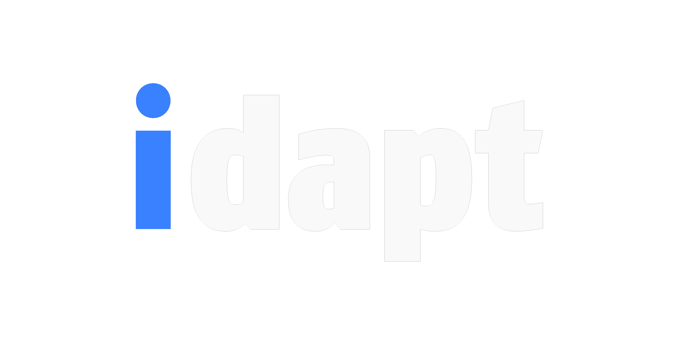

<picture>
  <source media="(prefers-color-scheme: dark)" srcset="./assets/idapt_logo_dark_transparent.png">
  <source media="(prefers-color-scheme: light)" srcset="./assets/idapt_logo_light_transparent.png">
  
</picture>

**[idapt](https://idapt.ai) allows you to create your own personal AI by regrouping your data from multiple sources (Files, Emails, Google Drive, etc.) and allow your AI assistant to use it in your chats to provide a fully personalized experience.**

Your data is completely encrypted so that even we cannot access it and the project is open source for complete transparency.

You can choose to host it yourself or use our hosted version at [idapt.ai](https://idapt.ai) that uses confidential computing and encryption to ensure that only you can access your data.

Go to the [website](https://idapt.ai) for more information.

**THE APP IS STILL AT A VERY EARLY STAGE AND BUGS ARE TO BE EXPECTED, ALWAYS BACKUP YOUR DATA ELSEWHERE TO PREVENT DATA LOSS UNTIL THE APP IS MORE STABLE.**

# Getting Started

## Production Installation

- Install [Docker](https://docs.docker.com/get-started/get-docker/) and add GPU support with the [NVIDIA Container Toolkit](https://docs.nvidia.com/datacenter/cloud-native/container-toolkit/install-guide.html) if you want faster inference and embeddings generation.
- Clone the repository with 
```bash
git clone https://github.com/idapt/idapt.git && cd idapt
```
- Fill in the `.env` file with the correct values.
- Run 
```bash
docker compose up
```
in the idapt root folder to start the production server.
*This will build the production images and start the containers in production mode with the settings you set in the `.env` file.*
- Access the app at [https://localhost](https://localhost). *(or to https://your-custom-host if you changed it for remote access)*
- Create your account using a secure password and setup your TOTP (Time-based One-Time Password) for extra security.
- Add your data sources, setup your settings (model provider, temperature, etc.) and start chatting with your private, personal AI assistant !

## Development Installation

In development mode, the frontend and backend folders are synced with the host folders so any changes you make to the code will be reflected directly in the containers.
The containers ports are also exposed to facilitate development.

### Start the containers

- Clone the repository with 
```bash
git clone https://github.com/idapt/idapt.git && cd idapt
```
- Create your '.env.local' file by copying the '.env' file and filling in the correct values.
- Run 
```bash
docker compose -f dev.docker-compose.yml --env-file .env.local up --build
```
in the idapt root folder to start the development server.
*This will start all the containers in development mode and sync the code changes between the host and the frontend and backend containers.*
- Access the app at [https://localhost](https://localhost). *(or to https://your-custom-host if you changed it for remote access)*
- Build or fix !

Development notes :
*The poetry dependencies are already installed in the container following the `pyproject.toml` file at build time.*
*The node_modules are synced with the host.*
*The developement stack and the production use different docker storage volumes as the compose name is different.*

## Architecture

See the compose file for more details on the architecture.
- FastAPI Python backend
- NextJS React frontend
- PostgreSQL database
- Keycloak for authentication
- Nginx for reverse proxy routing
- Certbot (in nginx container) for SSL certificates using Let's Encrypt for custom domains
- OAuth2 Proxy for authentication at nginx level (for keycloak)
- Ollama for simple local integrated LLM model and Embeddings provider